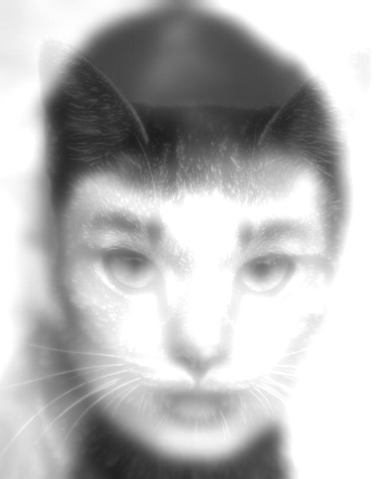

## File Descriptions 

- **assignment1.py:**  
  The main driver script.
  
- **keypointer.py:**  
  A script used to pick key feature points (e.g., eyes, nose, lips, and facial edges) from the images. These points are stored in keypoints files.
  
- **alignment.py:**  
  Aligns the images (e.g., warping the cat image onto Audrey's portrait) using the keypoints provided.
  
- **spatial_fusion.py:**  
  Implements spatial-domain blending using Laplacian pyramids to seamlessly merge images at different resolutions.
  
- **frequency_fusion.py:**  
  Implements frequency-domain blending by merging the low frequencies of one image with the high frequencies of another using FFT.

- **output_images:**  
  A folder that will contain the aligned and hybrid images.

## Steps

- **First:**  
  Run `python3 keypointer.py`. You will be prompted for an image (should be in the root directory). This image should be a JPG. Mark the keypoints. Then do the same for a second image but make sure the keypoints are exactly the same ones and in the same order as for the first image. After keypointing, the keypoints will be saved to `keypoints1` (for image 1) and `keypoints2` (for image 2).

- **Second:**  
  Run `python3 assignment1.py keypoints1 keypoints2` to generate the output images.

## Input Files

Make sure the following files are in the root directory:
- `image1.jpg` 
- `image2.jpg` 
- `keypoints1` (keypoints for image 1)
- `keypoints2` (keypoints for image 2)

  

## Output Files

After running `python3 assignment1.py keypoints1 keypoints2`, you should see 3 output images in the `output_images` folder:

  
  

