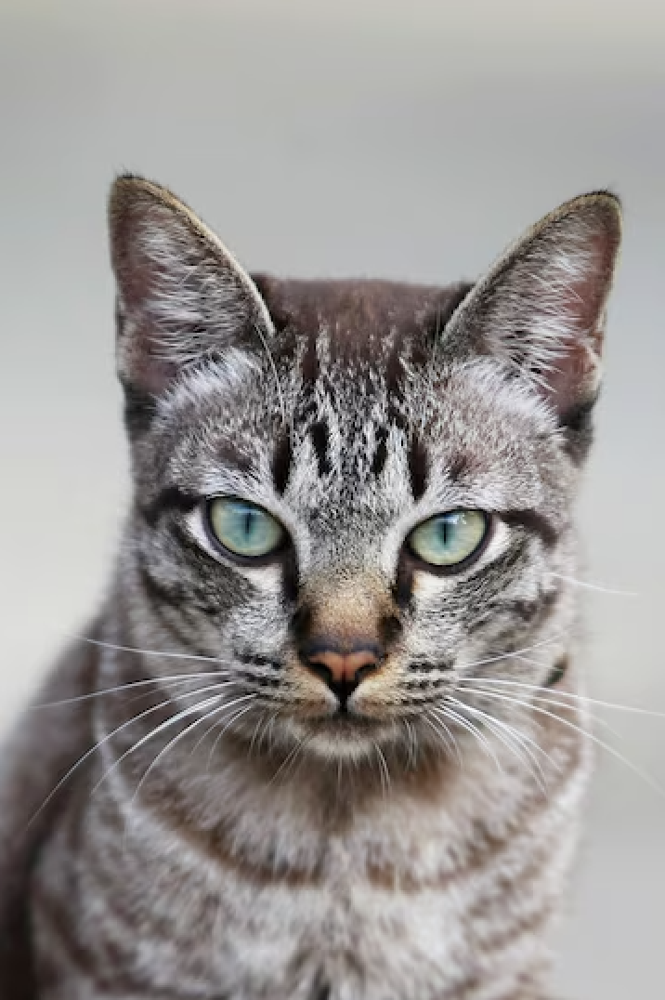

# Image Processing and Computer Vision: Hybrid Image Project Instructions & Report

## Instructions 

### Running and Output Files

- **Test default keypoints for default images and keypoints:**  
  After running python3 assignment1.py keypoints1 keypoints2, you should see 3 output images in the output_images folder: aligned.jpg (aligned image2), spatial_hybrid.jpg (gaussian/laplacian blending), and frequency_hybrid.jpg (low frequencies of image 1 blended with high frequencies of image2):

  
  
  


- **Testing new images and/or new keypoint coordinates:**  
  1. Run `python3 keypointer.py`. You will be prompted for an image (should be in the root directory). This image should be a JPG. Mark the keypoints. Then do the same for a second image—but make sure the keypoints are exactly the same ones and in the same order as for the first image. After keypointing, the keypoints will be saved to `keypoints1` (for image 1) and `keypoints2` (for image 2).
  2. Run `python3 assignment1.py keypoints1 keypoints2` to generate the output images.

### Parameter Tuning in the Scripts

You can also adjust key blending parameters directly in the code:
- In `spatial_fusion.py`, modify the **alpha** value (default is 0.65) to control the spatial blending of features.
- In `frequency_fusion.py`, tweak the **weight_low** (default is 0.6) and **weight_high** (default is 1.8) parameters to adjust the balance between low-frequency and high-frequency components.


### File Descriptions 

- **assignment1.py:**  
  The main driver script.
  
- **keypointer.py:**  
  A script used to pick key feature points (e.g., eyes, nose, lips, and facial edges) from the images. These points are stored in keypoints files.
  
- **alignment.py:**  
  Aligns the images (e.g., warping the cat image onto Audrey's portrait) using the keypoints provided.
  
- **spatial_fusion.py:**  
  Implements spatial-domain blending using Laplacian pyramids to seamlessly merge images at different resolutions.
  
- **frequency_fusion.py:**  
  Implements frequency-domain blending by merging the low frequencies of one image with the high frequencies of another using FFT.

- **output_images:**  
  A folder that will contain the aligned and hybrid images.

### Input Files

Make sure the following files are in the root directory:
- `image1.jpg` 
- `image2.jpg` 
- `keypoints1` (keypoints for image 1)
- `keypoints2` (keypoints for image 2)

**Default Images (Comes with Default Keypoints)**

  
  

## Report

### Introduction

I explored how to create hybrid images—pictures that can be seen in one of two ways. I tested many pairs, such as the Afghan Girl + tiger, Scarlett Johansson + cat, cat + tiger, and Iron Man + Robert Downey Jr. I even tried combining a snake with a staff, inspired by a biblical story. The best outcome was Audrey Hepburn + a cat, mostly because their faces aligned more naturally. I used Keypoint-Based Alignment (affine or resizing) to align these images, then applied Frequency-Domain Blending (FFT) and Spatial-Domain Blending (Gaussian/Laplacian pyramids) techniques to produce the hybrids.

### Alignment

I used the script `keypointer.py` to pick feature points like eyes, nose, lips, and edges of the face in both images. These points were stored in `keypoints1` and `keypoints2` and later read by `alignment.py` to align the cat image onto Audrey’s portrait. If keypoints are missing, the code simply resizes the cat image.

#### Affine Transformation (Rigid)

An affine transform can rotate, scale, translate, or shear an image while preserving parallelism. I used `cv2.estimateAffinePartial2D()` in my `_affine` function within the aligner to warp the cat image onto Audrey’s portrait in a stable, albeit limited, way.

#### Homography (Nonrigid)

I also tested `cv2.findHomography()`, which manages perspective changes, but it sometimes introduced extreme distortions because of the different shapes of cat and human faces. Although a nonrigid approach like thin plate splines might better align local features, I opted to stick with affine transformations for simplicity.

### Frequency-Domain Blending (FFT)

In `frequency_fusion.py`, I created a hybrid by merging the low frequencies from one image with the high frequencies from another using Fourier transforms. The process involved:
- Performing a 2D FFT (`np.fft.fft2`) on both images.
- Shifting the zero-frequency component to the center (`np.fft.fftshift`).
- Applying a Gaussian low-pass filter on image1 to retain its low-frequency areas.
- Applying a Gaussian high-pass filter on image2 to preserve its edges and textures.
- Using a cutoff frequency (`D0`) to control the detail retention.
- Inverting the shift (`np.fft.ifftshift`) and executing the inverse FFT (`np.fft.ifft2`) to obtain the processed images.
- Combining these components with adjustable weights:
  
  ```python
  hybrid_image = (weight_low * np.abs(inverse_low_frequency_component) +
                  weight_high * np.abs(inverse_high_frequency_component))
### Spatial-Domain Blending (Gaussian/Laplacian Pyramids)

In `spatial_fusion.py`, I generated hybrid images by blending various resolutions using Laplacian pyramids, which reduces harsh seams:

- **Gaussian Pyramids:**  
  Each image was downsampled 5–6 times using `cv2.pyrDown`, halving the dimensions and retaining only coarse details at higher levels.

- **Laplacian Pyramids:**  
  Formed by subtracting upsampled smaller images from the larger ones, revealing high-frequency edges.

- **Blending:**  
  At each level, a horizontal mask was used to merge the images. An alpha parameter (0.65) adjusted the prominence of the cat’s details.

- **Reconstruction:**  
  The final hybrid image (`spatial_hybrid.jpg`) was reconstructed by upsampling and adding the blended pyramid levels in reverse order.

### Observations

Good facial alignment was essential. Enlarging the cat image reduced some outline issues, yet a nonrigid alignment method (e.g., thin plate splines) might have better handled the differing face shapes of a cat and a human. The combination of Audrey Hepburn’s features with the cat worked well for both frequency and spatial fusion, particularly around the eyes and nose. Grayscale processing helped avoid color mismatches. Although `cv2.findHomography()` was explored, it often distorted the cat’s face due to the shape differences. The final aligned image is saved as `aligned.jpg`.

- **Frequency-Domain Hybrid:**  
  Blends Audrey Hepburn’s low-frequency features with the cat’s high-frequency details. Up close, the cat’s fur and whiskers are prominent; from a distance, Audrey’s face becomes clearer. Minor issues include slight misalignment and a grainy texture.

- **Spatial-Domain Hybrid:**  
  Preserves more of Audrey Hepburn’s facial structure while integrating the cat’s whiskers, nose, and fur. Transitions between textures are smoother, though some regions may appear grainy or overly sharp.

### Parameter Choices

- **Spatial Pyramids:** Approximately 6 levels.
- **Alpha (for spatial blending):** 0.65 (you can adjust this parameter in `spatial_fusion.py` to tweak the blending of facial features).
- **FFT Cutoff (D0):** ~50 (tested range: 30–60).
- **FFT Weights (for frequency blending):**  
  - `weight_low = 0.6`  
  - `weight_high = 1.8`  
  (These weights, defined in `frequency_fusion.py`, can be adjusted to modify the balance between low-frequency and high-frequency components.)


### References

1. [Python OpenCV Affine Transformation](https://www.geeksforgeeks.org/python-opencv-affine-transformation/?ref=header)
2. [Image Registration using OpenCV Python](https://www.geeksforgeeks.org/image-registration-using-opencv-python/)
3. [Creating Hybrid Images using OpenCV Python](https://www.geeksforgeeks.org/creating-hybrid-images-using-opencv-library-python/)
4. [OpenCV Fourier Transform Tutorial](https://docs.opencv.org/4.x/de/dbc/tutorial_py_fourier_transform.html)
5. [OpenCV Pyramids Tutorial](https://docs.opencv.org/4.x/dc/dff/tutorial_py_pyramids.html)


